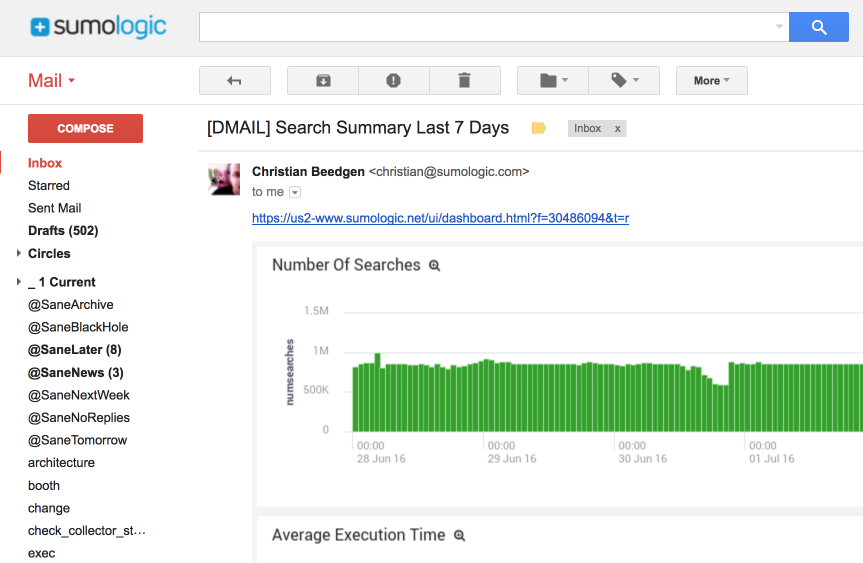
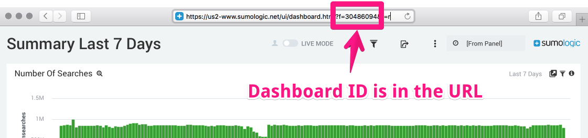

# dmail - Send Sumo Logic dashboards via email (Support AWS Ses)

A simple hack to capture a screenshot of a Sumo Logic dashboard, which is then embedded into an email.

Here is a quick teaser:



## Installation

On my Ubuntu box (running Vivid) this worked:

```bash
git clone https://github.com/SumoLogic/dmail.git
cd dmail/
curl -sL https://deb.nodesource.com/setup_4.x | sudo -E bash -
sudo apt-get install -y nodejs
npm install
```

This link was helpful: https://nodejs.org/en/download/package-manager/

I also have it working on my Mac, but forgot to take notes on the installation. `npm install` might be all that's required tho. Happy to add instructions here if somebody wants to submit a PR.

## Run

Simple - run `bin/dmail` with a giant commandline :)

Here's what I do:

```bash
bin/dmail -u [user] -p [password] -d us2 --dashboard-id 30486094 \
          --mail-user [mail-user] --mail-password [mail-password] --mail-host smtp.gmail.com \
          -r christian@sumologic.com \
          -s john@sumologic.com \
          --mail-subject "[DMAIL] Search Summary Last 7 Day
```

Here's the full explanation of the commandline arguments. Note that all parameters are required!

```
  Usage: dmail [options]

  Options:

    -h, --help                      output usage information
    -V, --version                   output the version number
    -u, --user <user>               user to log in as to Sumo Logic
    -p, --password <password>       password for logging in
    -d, --deployment <deployment>   name of the Sumo Logic deployment for logging in
    --dashboard-id <dashboardId>    ID of the dashboard to email
    --mail-user <mailUser>          mail user to log in as
    --mail-password <mailPassword>  password of the mail user
    --mail-host <mailHost>          mail host to send email
    --mail-subject <mailSubject>    the subject of the email
    -r, --receiver <receiver>       address of the receiver of the email
```

The all-important dashboard ID can be gleaned from the URL for the dashboard:


